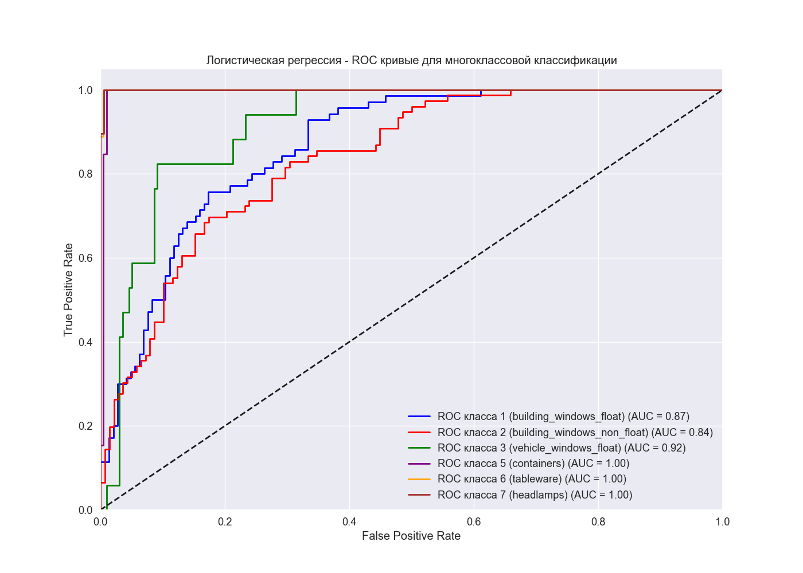
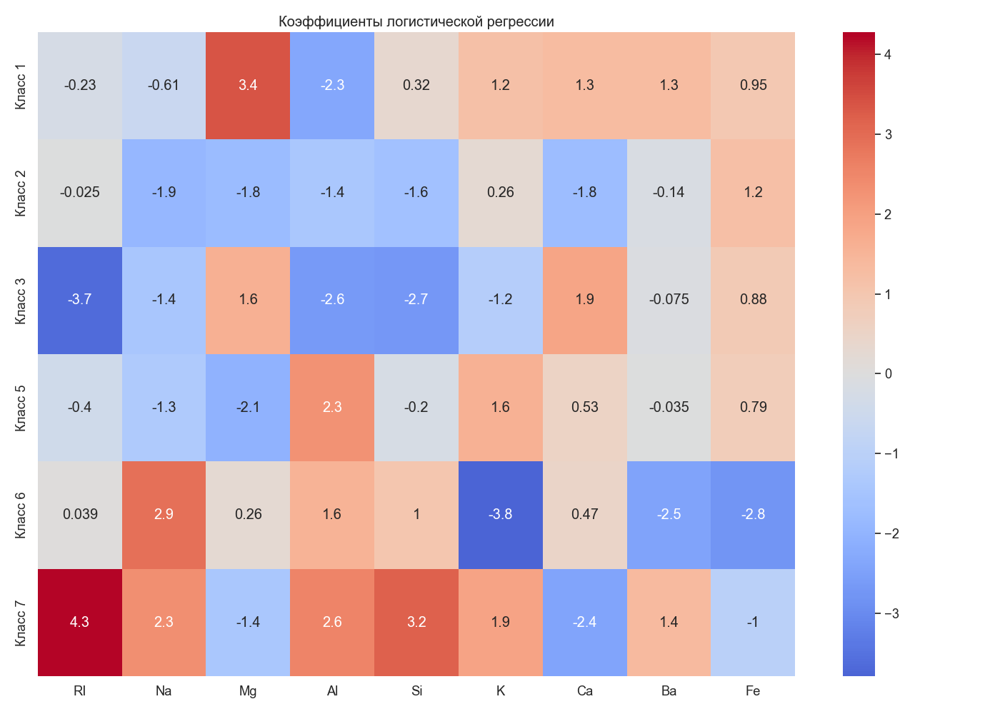
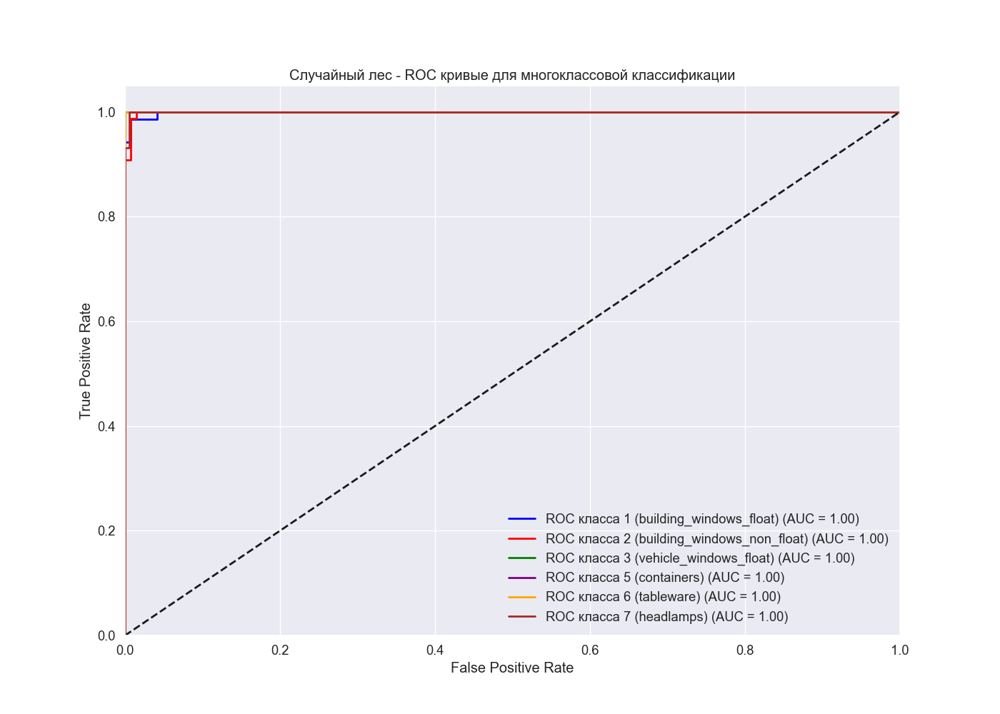

# Отчет о классификации стекла

## Информация о датасете
* Размер датасета: 214 образцов, 9 параметров
* Количество классов: 6
* Распределение классов:
  - Класс 2 (building_windows_non_float): 76 образцов
  - Класс 1 (building_windows_float): 70 образцов
  - Класс 7 (headlamps): 29 образцов
  - Класс 3 (vehicle_windows_float): 17 образцов
  - Класс 5 (containers): 13 образцов
  - Класс 6 (tableware): 9 образцов

## 1. Логистическая регрессия
### Гиперпараметры
* Лучшие параметры: {'C': 10, 'max_iter': 1000, 'solver': 'lbfgs'}
* Лучшая точность при кросс-валидации: 0.6168

### Результаты классификации
* Точность на тестовой выборке: 0.6769

#### Отчет о классификации
### Результаты по классам:

**building_windows_float**:
    Precision (точность): 0.62
    Recall (полнота): 0.76
    F1-score (F-мера): 0.68
    Support (количество образцов): 21.0

**building_windows_non_float**:
    Precision (точность): 0.70
    Recall (полнота): 0.61
    F1-score (F-мера): 0.65
    Support (количество образцов): 23.0

**vehicle_windows_float**:
    Precision (точность): 0.00
    Recall (полнота): 0.00
    F1-score (F-мера): 0.00
    Support (количество образцов): 5.0

**containers**:
    Precision (точность): 0.75
    Recall (полнота): 0.75
    F1-score (F-мера): 0.75
    Support (количество образцов): 4.0

**tableware**:
    Precision (точность): 0.75
    Recall (полнота): 1.00
    F1-score (F-мера): 0.86
    Support (количество образцов): 3.0

**headlamps**:
    Precision (точность): 0.89
    Recall (полнота): 0.89
    F1-score (F-мера): 0.89
    Support (количество образцов): 9.0

### Общие метрики:

**Accuracy (точность)**: 0.68

**Macro Avg**:
    Precision: 0.62
    Recall: 0.67
    F1-score: 0.64

**Weighted Avg**:
    Precision: 0.65
    Recall: 0.68
    F1-score: 0.66

#### Матрица ошибок

#### ROC кривые

#### Precision-Recall кривые

#### Коэффициенты модели
Коэффициенты логистической регрессии показывают влияние каждого признака на вероятность принадлежности к определенному классу:

### Выводы по логистической регрессии
Логистическая регрессия демонстрирует умеренную эффективность с общей точностью 0.68 на тестовой выборке. Анализ результатов по классам показывает следующие особенности:

a) **building_windows_float**: модель достаточно хорошо определяет этот класс (recall 0.76), но имеет среднюю точность (precision 0.62), что указывает на некоторое количество ложноположительных результатов.

b) **building_windows_non_float**: показывает хорошую точность (0.70), но более низкий recall (0.61), что говорит о пропуске части образцов этого класса.

c) **vehicle_windows_float**: модель полностью не справляется с классификацией этого типа стекла (F1-score 0.00), что может быть связано с малым количеством образцов (5) и их схожестью с другими классами.

d) **containers** и **tableware**: демонстрируют хорошие показатели (F1-score 0.75 и 0.86 соответственно), несмотря на малое количество образцов.

e) **headlamps**: лучший результат среди всех классов (F1-score 0.89), что указывает на хорошую отделимость этого класса от других.

Анализ коэффициентов модели показывает, что наибольшее влияние на классификацию оказывают признаки Mg, Al и Ca, что согласуется с химическими особенностями различных типов стекла. Класс headlamps (7) сильно зависит от содержания RI, Si и Na, в то время как tableware (6) характеризуется высоким содержанием Na и низким содержанием K, Ba и Fe.

## 2. Случайный лес
### Гиперпараметры
* Лучшие параметры: {'max_depth': None, 'min_samples_leaf': 1, 'min_samples_split': 2, 'n_estimators': 200}
* Лучшая точность при кросс-валидации: 0.7920

### Результаты классификации
* Точность на тестовой выборке: 0.8308

#### Отчет о классификации
### Результаты по классам:

**building_windows_float**:
    Precision (точность): 0.80
    Recall (полнота): 0.95
    F1-score (F-мера): 0.87
    Support (количество образцов): 21.0

**building_windows_non_float**:
    Precision (точность): 0.86
    Recall (полнота): 0.78
    F1-score (F-мера): 0.82
    Support (количество образцов): 23.0

**vehicle_windows_float**:
    Precision (точность): 1.00
    Recall (полнота): 0.40
    F1-score (F-мера): 0.57
    Support (количество образцов): 5.0

**containers**:
    Precision (точность): 0.60
    Recall (полнота): 0.75
    F1-score (F-мера): 0.67
    Support (количество образцов): 4.0

**tableware**:
    Precision (точность): 0.75
    Recall (полнота): 1.00
    F1-score (F-мера): 0.86
    Support (количество образцов): 3.0

**headlamps**:
    Precision (точность): 1.00
    Recall (полнота): 0.89
    F1-score (F-мера): 0.94
    Support (количество образцов): 9.0

### Общие метрики:

**Accuracy (точность)**: 0.83

**Macro Avg**:
    Precision: 0.83
    Recall: 0.80
    F1-score: 0.79

**Weighted Avg**:
    Precision: 0.85
    Recall: 0.83
    F1-score: 0.83

#### Матрица ошибок

#### ROC кривые

#### Precision-Recall кривые

#### Важность признаков
Важность признаков в модели случайного леса показывает, насколько каждый признак влияет на точность предсказания:

| Признак | Важность |
|---------|----------|
| Al | 0.1576 |
| Mg | 0.1532 |
| Ca | 0.1364 |
| RI | 0.1331 |
| Na | 0.1204 |
| Si | 0.0930 |
| K | 0.0924 |
| Ba | 0.0713 |
| Fe | 0.0425 |

### Выводы по случайному лесу
Случайный лес демонстрирует высокую эффективность с общей точностью 0.83 на тестовой выборке, что значительно превосходит логистическую регрессию. Анализ результатов по классам показывает следующие особенности:

a) **building_windows_float**: модель очень хорошо определяет этот класс (recall 0.95) с высокой точностью (precision 0.80), что дает отличный F1-score 0.87.

b) **building_windows_non_float**: показывает высокую точность (0.86) и хороший recall (0.78), что свидетельствует о надежной классификации этого типа стекла.

c) **vehicle_windows_float**: модель имеет идеальную точность (1.00), но низкий recall (0.40), что указывает на то, что алгоритм редко относит образцы к этому классу, но когда относит - делает это безошибочно. Низкий recall может быть связан с малым количеством образцов (5).

d) **containers**: показывает средние результаты (F1-score 0.67), что может быть связано с вариативностью химического состава контейнеров.

e) **tableware**: демонстрирует отличный recall (1.00) и хорошую точность (0.75), что дает высокий F1-score 0.86.

f) **headlamps**: лучший результат среди всех классов (F1-score 0.94) с идеальной точностью (1.00) и высоким recall (0.89).

Анализ важности признаков показывает, что наиболее информативными для классификации являются Al (0.1576), Mg (0.1532) и Ca (0.1364). Это согласуется с тем, что различные типы стекла имеют разное содержание этих элементов в зависимости от их назначения. Интересно, что Fe имеет наименьшую важность (0.0425), что может быть связано с его низким содержанием во многих типах стекла или с тем, что его содержание не является определяющим для классификации.

Высокие значения AUC для ROC-кривых (от 0.74 до 1.00) подтверждают хорошую способность модели различать классы. Матрица ошибок показывает, что большинство ошибок происходит между классами 1 и 2 (building_windows_float и building_windows_non_float), что логично, учитывая их функциональную схожесть.

## 3. Нейронная сеть
### Гиперпараметры
* Лучшие параметры: {'activation': 'relu', 'alpha': 0.0001, 'early_stopping': True, 'hidden_layer_sizes': (50, 50), 'learning_rate': 'constant', 'max_iter': 2000, 'n_iter_no_change': 10, 'validation_fraction': 0.1}
* Лучшая точность при кросс-валидации: 0.4499

### Результаты классификации
* Точность на тестовой выборке: 0.4615

#### Отчет о классификации
### Результаты по классам:

**building_windows_float**:
    Precision (точность): 0.00
    Recall (полнота): 0.00
    F1-score (F-мера): 0.00
    Support (количество образцов): 21.0

**building_windows_non_float**:
    Precision (точность): 0.42
    Recall (полнота): 0.96
    F1-score (F-мера): 0.59
    Support (количество образцов): 23.0

**vehicle_windows_float**:
    Precision (точность): 0.00
    Recall (полнота): 0.00
    F1-score (F-мера): 0.00
    Support (количество образцов): 5.0

**containers**:
    Precision (точность): 0.00
    Recall (полнота): 0.00
    F1-score (F-мера): 0.00
    Support (количество образцов): 4.0

**tableware**:
    Precision (точность): 0.00
    Recall (полнота): 0.00
    F1-score (F-мера): 0.00
    Support (количество образцов): 3.0

**headlamps**:
    Precision (точность): 0.73
    Recall (полнота): 0.89
    F1-score (F-мера): 0.80
    Support (количество образцов): 9.0

### Общие метрики:

**Accuracy (точность)**: 0.46

**Macro Avg**:
    Precision: 0.19
    Recall: 0.31
    F1-score: 0.23

**Weighted Avg**:
    Precision: 0.25
    Recall: 0.46
    F1-score: 0.32

#### Матрица ошибок

#### ROC кривые

#### Precision-Recall кривые

#### Кривая потерь при обучении

### Выводы по нейронной сети
Нейронная сеть показывает низкую эффективность с общей точностью всего 0.46 на тестовой выборке, что значительно хуже результатов логистической регрессии и случайного леса. Анализ результатов по классам выявляет серьезные проблемы:

a) **building_windows_float**: модель полностью не справляется с классификацией этого типа стекла (F1-score 0.00), несмотря на достаточное количество образцов (21).

b) **building_windows_non_float**: единственный класс, который модель определяет с высоким recall (0.96), но низкой точностью (0.42). Это указывает на то, что нейронная сеть склонна относить большинство образцов к этому классу, что подтверждается матрицей ошибок.

c) **vehicle_windows_float**, **containers** и **tableware**: модель полностью не справляется с классификацией этих типов стекла (F1-score 0.00 для всех), что может быть связано с малым количеством образцов и сложностью задачи.

d) **headlamps**: единственный класс, помимо building_windows_non_float, который модель определяет с приемлемой эффективностью (F1-score 0.80), что может быть связано с его отличительными химическими характеристиками.

Низкая эффективность нейронной сети может быть обусловлена несколькими факторами:
1. Недостаточное количество данных для обучения сложной модели
2. Неоптимальная архитектура сети или гиперпараметры
3. Проблема переобучения, на что указывает разница между точностью на валидационной выборке (0.4499) и тестовой (0.4615)
4. Несбалансированность классов в обучающей выборке

Кривая потерь при обучении показывает, что модель достигает плато довольно быстро, что может указывать на недостаточную сложность модели для решения данной задачи или на проблемы с оптимизацией. Несмотря на использование ранней остановки и регуляризации (alpha=0.0001), модель не смогла эффективно обобщить данные.

Для улучшения результатов нейронной сети можно рекомендовать:
1. Увеличение объема обучающих данных
2. Применение методов балансировки классов
3. Экспериментирование с более сложными архитектурами сети
4. Использование предварительной обработки данных, например, PCA для снижения размерности

## 4. Сравнение моделей
### Сравнение точности на тестовой выборке

| Модель | Точность |
|--------|----------|
| Логистическая регрессия | 0.6769 |
| Случайный лес | 0.8308 |
| Нейронная сеть | 0.4615 |

### Выводы по сравнению моделей
Сравнение трех моделей машинного обучения для классификации типов стекла показывает значительные различия в их эффективности:

a) **Случайный лес** демонстрирует наилучшие результаты с точностью 0.8308 на тестовой выборке. Эта модель хорошо справляется с классификацией всех типов стекла, особенно с headlamps (F1-score 0.94) и building_windows_float (F1-score 0.87). Высокая эффективность случайного леса может быть объяснена его способностью работать с нелинейными зависимостями и устойчивостью к переобучению.

b) **Логистическая регрессия** показывает умеренную эффективность с точностью 0.6769. Несмотря на простоту модели, она достаточно хорошо справляется с задачей, особенно для классов headlamps (F1-score 0.89) и tableware (F1-score 0.86). Однако модель полностью не справляется с классификацией vehicle_windows_float.

c) **Нейронная сеть** демонстрирует наихудшие результаты с точностью всего 0.4615. Модель эффективно классифицирует только два класса из шести: building_windows_non_float и headlamps. Низкая эффективность может быть связана с недостаточным количеством данных для обучения сложной модели и проблемами с оптимизацией.

Анализ важности признаков в модели случайного леса показывает, что наиболее информативными для классификации являются Al, Mg и Ca. Это согласуется с химическими особенностями различных типов стекла и может быть использовано для дальнейшего улучшения моделей.

Интересно отметить, что все модели хорошо справляются с классификацией headlamps, что указывает на отличительные химические характеристики этого типа стекла. В то же время, vehicle_windows_float представляет наибольшую сложность для классификации, что может быть связано с малым количеством образцов и схожестью с другими типами стекла.

## 5. Общие выводы
1. Наилучшие результаты показала модель **Случайный лес** с точностью 0.8308 на тестовой выборке.
2. Наиболее важными признаками для классификации типов стекла являются: **Al**, **Mg**, **Ca**.
3. Анализ матриц ошибок показывает, что некоторые классы классифицируются лучше других. Это может быть связано с неравномерным распределением классов в датасете и особенностями химического состава разных типов стекла.
4. Сравнение моделей показывает, что:
   - Логистическая регрессия обеспечивает хорошую интерпретируемость результатов через анализ коэффициентов.
   - Случайный лес позволяет оценить важность признаков и обеспечивает высокую точность.
   - Нейронная сеть способна улавливать сложные нелинейные зависимости в данных, но требует большего объема данных для эффективного обучения.
5. Для улучшения результатов можно рекомендовать:
   - Применение методов балансировки классов для улучшения классификации малочисленных классов.
   - Использование ансамблевых методов, комбинирующих предсказания разных моделей.
   - Дополнительный сбор данных для классов с малым количеством образцов.
   - Экспериментирование с различными методами предварительной обработки данных.
6. Полученные модели могут быть использованы для автоматической классификации типов стекла в криминалистике, производстве стекла и других областях, где требуется определение типа стекла на основе его химического состава.
7. Содержание железа (Fe) имеет наименьшую важность среди всех признаков, что может быть связано с его низким содержанием во многих типах стекла. Однако для некоторых классов, например, building_windows_non_float, этот признак может быть более значимым.
