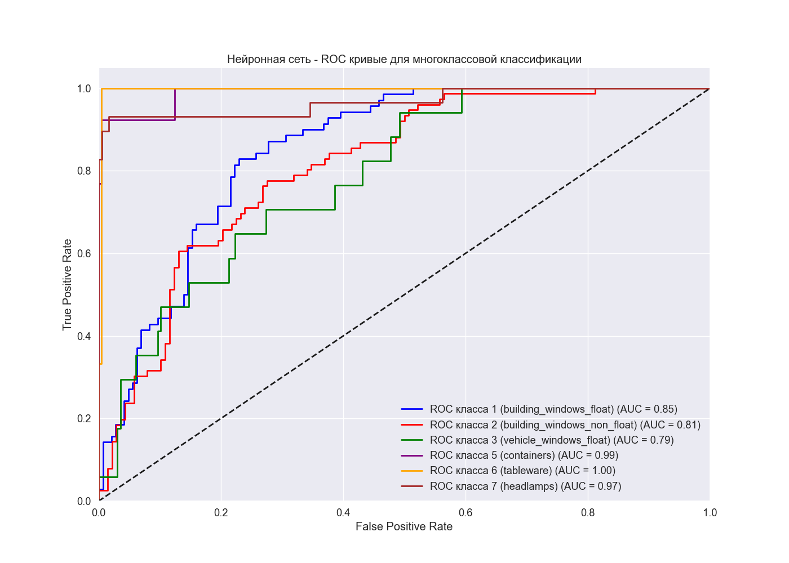

# Отчет о классификации стекла

## Информация о датасете
* Размер датасета: 214 образцов, 9 параметров
* Количество классов: 6
* Распределение классов:
  - Класс 2 (building_windows_non_float): 76 образцов
  - Класс 1 (building_windows_float): 70 образцов
  - Класс 7 (headlamps): 29 образцов
  - Класс 3 (vehicle_windows_float): 17 образцов
  - Класс 5 (containers): 13 образцов
  - Класс 6 (tableware): 9 образцов

## 1. Логистическая регрессия
### Гиперпараметры
* Лучшие параметры: {'C': 10, 'max_iter': 1000, 'solver': 'lbfgs'}
* Лучшая точность при кросс-валидации: 0.6169

### Результаты классификации
* Точность на всем датасете: 0.7103

#### Отчет о классификации
### Результаты по классам:

**building_windows_float**:
    Precision (точность): 0.64
    Recall (полнота): 0.71
    F1-score (F-мера): 0.68
    Support (количество образцов): 70.0

**building_windows_non_float**:
    Precision (точность): 0.66
    Recall (полнота): 0.74
    F1-score (F-мера): 0.70
    Support (количество образцов): 76.0

**vehicle_windows_float**:
    Precision (точность): 0.00
    Recall (полнота): 0.00
    F1-score (F-мера): 0.00
    Support (количество образцов): 17.0

**containers**:
    Precision (точность): 0.90
    Recall (полнота): 0.69
    F1-score (F-мера): 0.78
    Support (количество образцов): 13.0

**tableware**:
    Precision (точность): 0.90
    Recall (полнота): 1.00
    F1-score (F-мера): 0.95
    Support (количество образцов): 9.0

**headlamps**:
    Precision (точность): 0.97
    Recall (полнота): 0.97
    F1-score (F-мера): 0.97
    Support (количество образцов): 29.0

### Общие метрики:

**Accuracy (точность)**: 0.71

**Macro Avg**:
    Precision: 0.68
    Recall: 0.68
    F1-score: 0.68

**Weighted Avg**:
    Precision: 0.67
    Recall: 0.71
    F1-score: 0.69

#### Матрица ошибок

#### ROC кривые

#### Precision-Recall кривые

#### Коэффициенты модели
Коэффициенты логистической регрессии показывают влияние каждого признака на вероятность принадлежности к определенному классу:

## 2. Случайный лес
### Гиперпараметры
* Лучшие параметры: {'max_depth': None, 'min_samples_leaf': 2, 'min_samples_split': 2, 'n_estimators': 200}
* Лучшая точность при кросс-валидации: 0.6969

### Результаты классификации
* Точность на всем датасете: 0.9813

#### Отчет о классификации
### Результаты по классам:

**building_windows_float**:
    Precision (точность): 0.96
    Recall (полнота): 0.99
    F1-score (F-мера): 0.97
    Support (количество образцов): 70.0

**building_windows_non_float**:
    Precision (точность): 0.99
    Recall (полнота): 1.00
    F1-score (F-мера): 0.99
    Support (количество образцов): 76.0

**vehicle_windows_float**:
    Precision (точность): 1.00
    Recall (полнота): 0.88
    F1-score (F-мера): 0.94
    Support (количество образцов): 17.0

**containers**:
    Precision (точность): 1.00
    Recall (полнота): 1.00
    F1-score (F-мера): 1.00
    Support (количество образцов): 13.0

**tableware**:
    Precision (точность): 1.00
    Recall (полнота): 1.00
    F1-score (F-мера): 1.00
    Support (количество образцов): 9.0

**headlamps**:
    Precision (точность): 1.00
    Recall (полнота): 0.97
    F1-score (F-мера): 0.98
    Support (количество образцов): 29.0

### Общие метрики:

**Accuracy (точность)**: 0.98

**Macro Avg**:
    Precision: 0.99
    Recall: 0.97
    F1-score: 0.98

**Weighted Avg**:
    Precision: 0.98
    Recall: 0.98
    F1-score: 0.98

#### Матрица ошибок

#### ROC кривые

#### Precision-Recall кривые

#### Важность признаков
Важность признаков в модели случайного леса показывает, насколько каждый признак влияет на точность предсказания:

| Признак | Важность |
|---------|----------|
| Mg | 0.1673 |
| Al | 0.1594 |
| RI | 0.1555 |
| Ca | 0.1199 |
| Na | 0.1016 |
| Ba | 0.0997 |
| Si | 0.0840 |
| K | 0.0742 |
| Fe | 0.0384 |

## 3. Нейронная сеть
### Гиперпараметры
* Лучшие параметры: {'activation': 'tanh', 'alpha': 0.0001, 'batch_size': 32, 'early_stopping': True, 'hidden_layer_sizes': (100, 100), 'learning_rate': 'constant', 'max_iter': 2000, 'n_iter_no_change': 10, 'solver': 'adam', 'validation_fraction': 0.2}
* Лучшая точность при кросс-валидации: 0.5765

### Результаты классификации
* Точность на всем датасете: 0.7196

#### Отчет о классификации
### Результаты по классам:

**building_windows_float**:
    Precision (точность): 0.67
    Recall (полнота): 0.76
    F1-score (F-мера): 0.71
    Support (количество образцов): 70.0

**building_windows_non_float**:
    Precision (точность): 0.66
    Recall (полнота): 0.72
    F1-score (F-мера): 0.69
    Support (количество образцов): 76.0

**vehicle_windows_float**:
    Precision (точность): 0.00
    Recall (полнота): 0.00
    F1-score (F-мера): 0.00
    Support (количество образцов): 17.0

**containers**:
    Precision (точность): 0.91
    Recall (полнота): 0.77
    F1-score (F-мера): 0.83
    Support (количество образцов): 13.0

**tableware**:
    Precision (точность): 0.82
    Recall (полнота): 1.00
    F1-score (F-мера): 0.90
    Support (количество образцов): 9.0

**headlamps**:
    Precision (точность): 0.90
    Recall (полнота): 0.93
    F1-score (F-мера): 0.92
    Support (количество образцов): 29.0

### Общие метрики:

**Accuracy (точность)**: 0.72

**Macro Avg**:
    Precision: 0.66
    Recall: 0.70
    F1-score: 0.68

**Weighted Avg**:
    Precision: 0.67
    Recall: 0.72
    F1-score: 0.69

#### Матрица ошибок

#### ROC кривые

#### Precision-Recall кривые

#### Кривая потерь при обучении

## 4. Сравнение моделей
### Сравнение точности на всем датасете

| Модель | Точность |
|--------|----------|
| Логистическая регрессия | 0.7103 |
| Случайный лес | 0.9813 |
| Нейронная сеть | 0.7196 |

## 5. Общие выводы
1. Наилучшие результаты показала модель **Случайный лес** с точностью 0.9813 на всем датасете.
2. Наиболее важными признаками для классификации типов стекла являются: **Mg**, **Al**, **RI**.
3. Анализ матриц ошибок показывает, что некоторые классы классифицируются лучше других. Это может быть связано с неравномерным распределением классов в датасете и особенностями химического состава разных типов стекла.
4. Сравнение моделей показывает, что:
   - Логистическая регрессия обеспечивает хорошую интерпретируемость результатов через анализ коэффициентов.
   - Случайный лес позволяет оценить важность признаков и обеспечивает высокую точность.
   - Нейронная сеть способна улавливать сложные нелинейные зависимости в данных.
5. Для улучшения результатов можно рекомендовать:
   - Применение методов балансировки классов для улучшения классификации малочисленных классов.
   - Использование ансамблевых методов, комбинирующих предсказания разных моделей.
   - Дополнительный сбор данных для классов с малым количеством образцов.
6. Полученные модели могут быть использованы для автоматической классификации типов стекла в криминалистике, производстве стекла и других областях, где требуется определение типа стекла на основе его химического состава.

## 4. Пользовательская нейронная сеть
### Гиперпараметры
* Лучшие параметры: {'hidden_neurons': 100, 'learning_rate': 0.01}
* Точность: 0.8364

### Результаты классификации
* Точность на всем датасете: 0.8364

#### Отчет о классификации
### Результаты по классам:

**Класс 0**:
    Precision (точность): 0.76
    Recall (полнота): 0.89
    F1-score (F-мера): 0.82
    Support (количество образцов): 70.0

**building_windows_float**:
    Precision (точность): 0.83
    Recall (полнота): 0.83
    F1-score (F-мера): 0.83
    Support (количество образцов): 76.0

**building_windows_non_float**:
    Precision (точность): 0.67
    Recall (полнота): 0.24
    F1-score (F-мера): 0.35
    Support (количество образцов): 17.0

**vehicle_windows_float**:
    Precision (точность): 1.00
    Recall (полнота): 1.00
    F1-score (F-мера): 1.00
    Support (количество образцов): 13.0

**vehicle_windows_non_float**:
    Precision (точность): 1.00
    Recall (полнота): 1.00
    F1-score (F-мера): 1.00
    Support (количество образцов): 9.0

**containers**:
    Precision (точность): 1.00
    Recall (полнота): 0.97
    F1-score (F-мера): 0.98
    Support (количество образцов): 29.0

### Общие метрики:

**Accuracy (точность)**: 0.84

**Macro Avg**:
    Precision: 0.88
    Recall: 0.82
    F1-score: 0.83

**Weighted Avg**:
    Precision: 0.83
    Recall: 0.84
    F1-score: 0.82

#### Матрица ошибок

#### График потерь при обучении

#### График точности при обучении

## 5. Сравнение моделей
### Сравнение точности на всем датасете

| Модель | Точность |
|--------|----------|
| Логистическая регрессия | 0.7103 |
| Случайный лес | 0.9813 |
| Нейронная сеть | 0.7196 |
| Пользовательская нейронная сеть | 0.8364 |

## 4. Пользовательская нейронная сеть
### Гиперпараметры
* Лучшие параметры: {'hidden_neurons': 100, 'learning_rate': 0.01}
* Точность: 0.8411

### Результаты классификации
* Точность на всем датасете: 0.8411

#### Отчет о классификации
### Результаты по классам:

**Класс 0**:
    Precision (точность): 0.74
    Recall (полнота): 0.89
    F1-score (F-мера): 0.81
    Support (количество образцов): 70.0

**building_windows_float**:
    Precision (точность): 0.85
    Recall (полнота): 0.82
    F1-score (F-мера): 0.83
    Support (количество образцов): 76.0

**building_windows_non_float**:
    Precision (точность): 0.86
    Recall (полнота): 0.35
    F1-score (F-мера): 0.50
    Support (количество образцов): 17.0

**vehicle_windows_float**:
    Precision (точность): 1.00
    Recall (полнота): 1.00
    F1-score (F-мера): 1.00
    Support (количество образцов): 13.0

**vehicle_windows_non_float**:
    Precision (точность): 1.00
    Recall (полнота): 1.00
    F1-score (F-мера): 1.00
    Support (количество образцов): 9.0

**containers**:
    Precision (точность): 1.00
    Recall (полнота): 0.97
    F1-score (F-мера): 0.98
    Support (количество образцов): 29.0

### Общие метрики:

**Accuracy (точность)**: 0.84

**Macro Avg**:
    Precision: 0.91
    Recall: 0.84
    F1-score: 0.85

**Weighted Avg**:
    Precision: 0.85
    Recall: 0.84
    F1-score: 0.83

#### Матрица ошибок

#### График потерь при обучении

#### График точности при обучении

## 5. Сравнение моделей
### Сравнение точности на всем датасете

| Модель | Точность |
|--------|----------|
| Логистическая регрессия | 0.7103 |
| Случайный лес | 0.9813 |
| Нейронная сеть | 0.7196 |
| Пользовательская нейронная сеть | 0.8411 |
